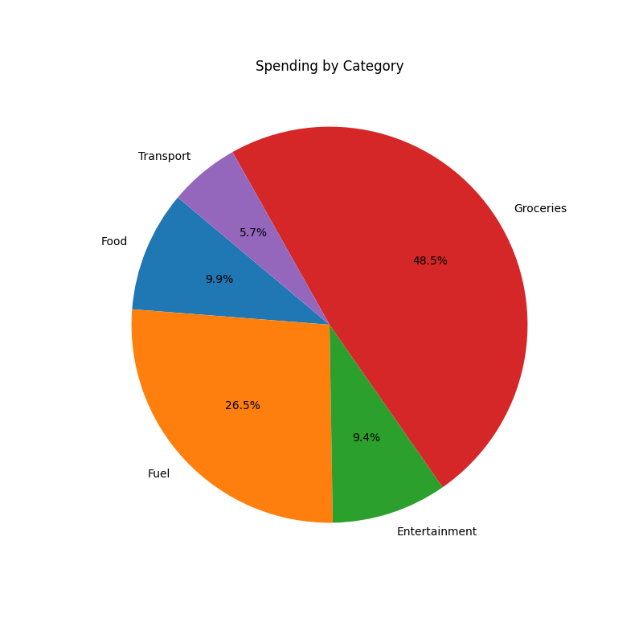

# 📊 Expense Insights Dashboard

A Python data analysis tool that reads personal expense data from CSV files and generates spending summaries and visualizations to provide financial insights.

## Features
- Calculates total spending
- Groups expenses by category
- Identifies high-cost categories
- Generates a spending pie chart
- Saves chart as an image for reports or documentation

  ## How to Run

1. Install Python 3.11+ from https://www.python.org and ensure it is added to your system PATH.
2. Clone or download this repository.
3. Open a terminal and navigate to the project folder.
4. Install the required dependency:

```bash
python -m pip install matplotlib

Run the program:
python expense_analyzer.py
Note: Ensure `expenses.csv` remains in the same directory as `expense_analyzer.py` so the program can read the data correctly.

Below is an example of the terminal output produced when analyzing the included sample dataset:
## Sample Output

===== Expense Insights Dashboard Report =====

Total Spending: $169.79

Spending by Category:

Food: $16.75

Fuel: $45.00

Entertainment: $15.99

Groceries: $82.30

Transport: $9.75

## Spending Breakdown (Pie Chart)



